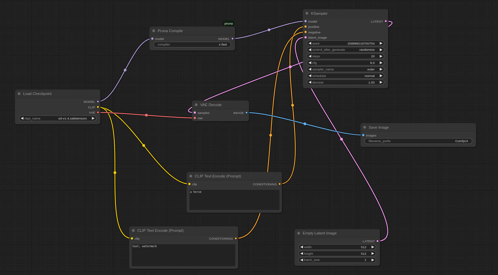
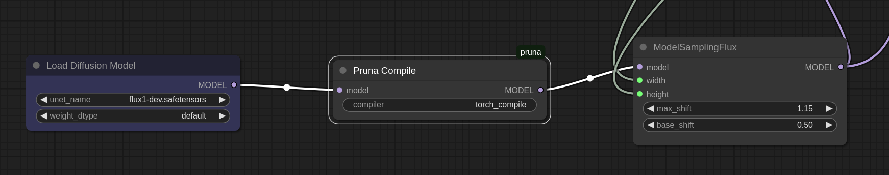
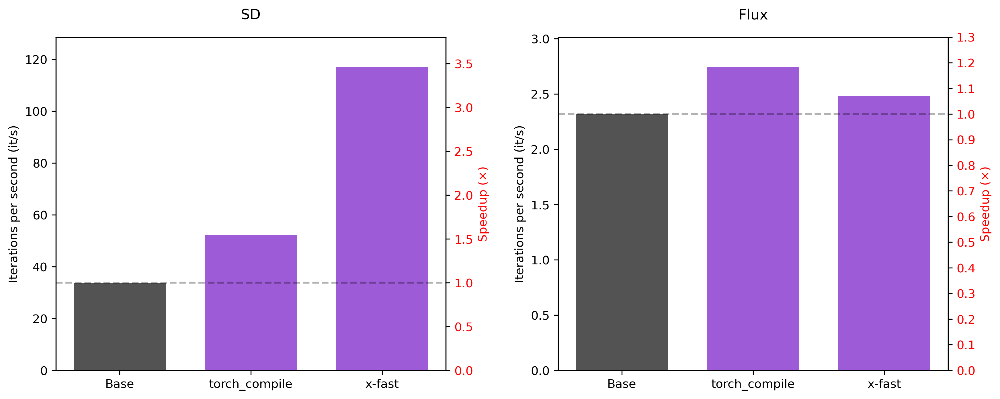
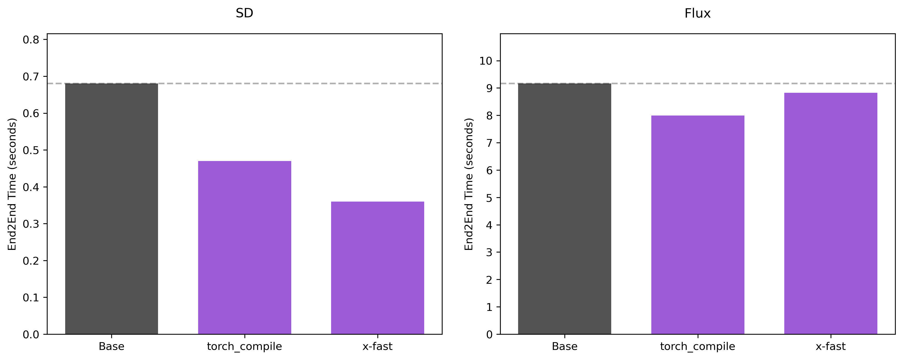

# Pruna nodes for ComfyUI

This repository explains how to accelerate image generation in ComfyUI using **Pruna**, an inference optimization engine that makes AI models **faster, smaller, cheaper, and greener**.
ComfyUI is a popular node-based GUI for image generation models, for which we provide a custom **compilation node** that accelerates **Stable Diffusion (SD)** and **Flux** inference, 
while preserving output quality.

Here, you'll find:
- [Installation and usage instructions](#installation)
- [Representative workflows](#usage-example)
- [Performance benchmarks](#performance)

## Installation

### Prerequisites
1. Create a new conda environment with Python 3.10
2. Install [ComfyUI](https://github.com/comfyanonymous/ComfyUI)
3. Install the latest version of [Pruna](https://docs.pruna.ai/en/latest/setup/pip.html)
4. Generate a Pruna token, following the instructions [here](https://docs.pruna.ai/en/latest/setup/token.html)

### Steps
1. **Navigate to your ComfyUI installation's `custom_nodes` folder:**
```bash
cd <path_to_comfyui>/custom_nodes
```
2. **Clone this repository:**
```bash
git clone https://github.com/PrunaAI/ComfyUI_pruna.git
```
3. **Launch ComfyUI**, for example, with:
```bash
cd <path_to_comfyui> && python main.py --disable-cuda-malloc --gpu-only
```

The Pruna node will appear in the nodes menu in the `Pruna` category. 

**Important note**: The current implementation requires launching ComfyUI with the `--disable-cuda-malloc` flag; 
otherwise the node may not function properly. For optimal performance, we also recommend setting the 
`--gpu-only` flag. 

## Usage Example

We provide two example workflows: one using a [Stable Diffusion](#example-1-stable-diffusion) model and another based on [Flux](#example-2-flux). 

To load the  workflow:
- Drag and drop the provided json file (for [SD](/workflows/SD.json) or [Flux](/workflows/flux.json)) into the ComfyUI window
- **OR** Click `Open` in the `Workflow` tab, as shown [here](./images/comfy_gui.png), and select the file

Through the GUI, you can choose your preferred compilation mode. Currently, we support `x-fast` and `torch_compile`, with `x-fast` set as the default.


### Model Setup

#### Example 1: Stable Diffusion

You have two options for the base model:

##### Option 1: SafeTensors Format (Recommended)
1. Download the [safetensors version](https://huggingface.co/CompVis/stable-diffusion-v-1-4-original/resolve/refs%2Fpr%2F228/sd-v1-4.safetensors) 
2. Place it in `<path_to_comfyui>/models/checkpoints`

##### Option 2: Diffusers Format
1. Download the Diffusers version of SD v1.4
2. Place it in `<path_to_comfyui>/models/diffusers`
3. Replace the `Load Checkpoint` node with a `DiffusersLoader` node

The node is tested using the SafeTensors format, so for the 
sake of reproducibility, we recommend using that format. 
However, we don't expect any performance differences between the two.



**Note**: In this example, we use the [Stable Diffusion v1.4](https://huggingface.co/CompVis/stable-diffusion-v-1-4-original) model. However, our node is compatible with any other SD model —
feel free to use your favorite one!


#### Example 2: Flux
To use Flux, you must separately download all model components—including the VAE, CLIP, and diffusion model weights—and place them in the appropriate folder. 

**Steps to set up Flux:**
1. **For the CLIP models:** Get the following files:
    - [clip_l.safetensors](https://huggingface.co/comfyanonymous/flux_text_encoders/blob/main/clip_l.safetensors)
    - [t5xxl_fp16.safetensors](https://huggingface.co/comfyanonymous/flux_text_encoders/blob/main/t5xxl_fp16.safetensors)

    Move them to `<path_to_comfyui>/models/clip/`.
2. **For the VAE model:** 
Get the [VAE](https://huggingface.co/black-forest-labs/FLUX.1-schnell/blob/main/ae.safetensors) model, and move it to `<path_to_comfyui>/models/vae/` directory. 
3. **For the Flux model:** 
You first need to request access to the model [here](https://huggingface.co/black-forest-labs/FLUX.1-dev). Once you have access, download the [weights](https://huggingface.co/black-forest-labs/FLUX.1-dev/blob/main/flux1-dev.safetensors) and move them to `<path_to_comfyui>/models/diffusion_models/`. 




## Performance

The node was tested on an NVIDIA L40S GPU. Below, we compare the performance of the base model, with the models compiled with Pruna's `x-fast` and `torch_compile` compilation modes. 

- The first figure presents the performance in iterations per second, as reported by `ComfyUI`.
- The second figure shows the end-to-end time required to generate a single image.




## Contact

For **questions, feedback or community discussions**, feel free to join our [Discord](https://discord.com/invite/Tun8YgzxZ9). 

For **bug reports or technical issues**, please open an issue in this repository. 

