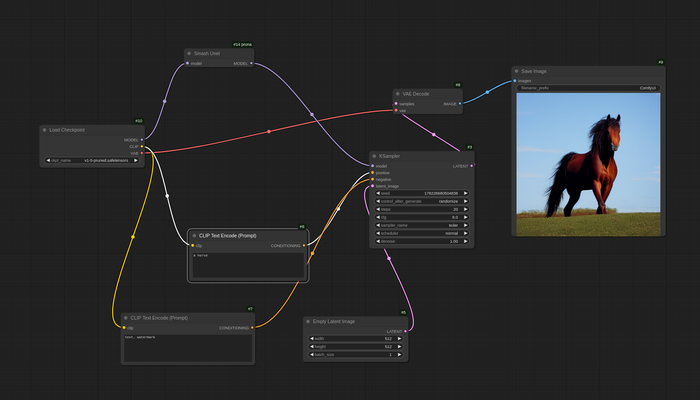

# Pruna AI ComfyUI Integration

A custom node for ComfyUI that accelerates Stable Diffusion inference using [Pruna](https://docs.pruna.ai/en/latest/index.html). In its current form, the node applies only x-fast compilation.

## Installation

### Prerequisites
1. Create a new conda environment with Python 3.10
2. Install [ComfyUI](https://github.com/comfyanonymous/ComfyUI)
3. Install the latest version of [Pruna](https://docs.pruna.ai/en/latest/setup/pip.html)

### Steps
1. Navigate to your ComfyUI installation's `custom_nodes` folder
2. Clone this repository
3. Launch ComfyUI

The Pruna node will appear in the nodes menu under `loaders`.

**Important note**: Current implementation relies on launching ComfyUI with the flag `--disable-cuda-malloc`, 
otherwise, the node will not work. For optimal performance, we recommend also setting the 
flag `--gpu-only`. These flags can be added when starting ComfyUI from the command line:
```bash
python main.py --disable-cuda-malloc --gpu-only
```


## Usage Example

The example workflow below demonstrates how to use Pruna to optimize the UNet component of Stable Diffusion v1.4.

To load the example workflow:
- Drag and drop the provided `.json` file from the `workflows` folder into the ComfyUI window, or
- Click `Open` in the `Workflow` tab (top-left corner of ComfyUI)

### Model Setup
You have two options for the base model:

#### Option 1: SafeTensors Format (Recommended)
1. Download the [.safetensors version](https://huggingface.co/CompVis/stable-diffusion-v-1-4-original/resolve/refs%2Fpr%2F228/sd-v1-4.safetensors) from Hugging Face
2. Place it in `<path_to_comfyui>/models/checkpoints`

#### Option 2: Diffusers Format
1. Download the Diffusers version of SD v1.4
2. Place it in `<path_to_comfyui>/models/diffusers`
3. Replace the `Load Checkpoint` node with a `DiffusersLoader` node

The node is tested using the SafeTensors format, so for the 
sake of reproducibility, we recommend using that format. 
However, we don't expect any performance differences between the two.



