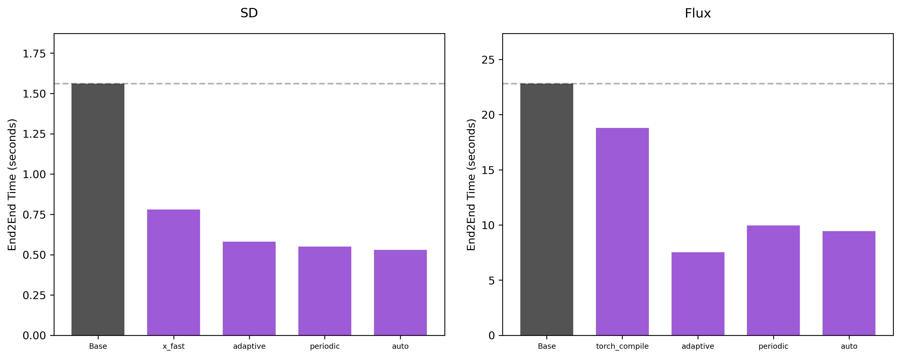
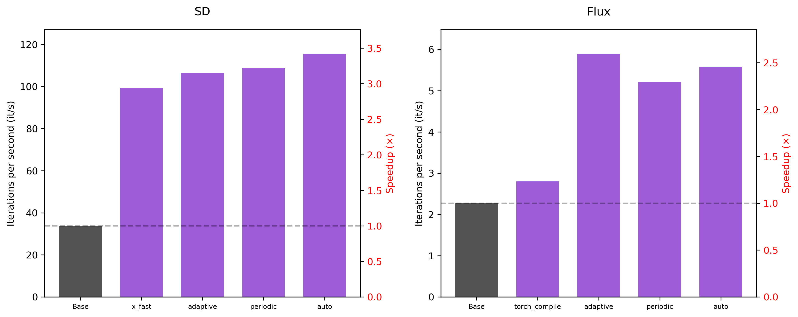
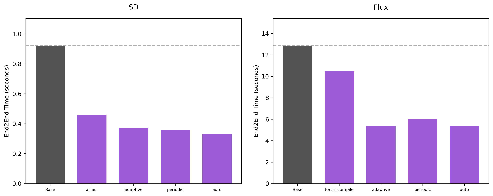

# Pruna nodes for ComfyUI

This repository explains how to accelerate image generation in ComfyUI using **Pruna**, an inference optimization engine that makes AI models **faster, smaller, cheaper, and greener**. ComfyUI is a popular node-based GUI for image generation models, for which we provide the following nodes:
- a **compilation node**, that optimizes inference speed through model compilation. While this technique fully preserves output quality, performance gains can vary depending on the model.
- **Caching nodes** that smartly reuse intermediate computations to accelerate inference with minimal quality degradation. In particular, we provide three caching nodes, each one using a different caching strategy:
    - [Adaptive Caching](https://docs.pruna.ai/en/stable/compression.html#adaptive-pro): Dynamically adjusts caching for each prompt by identifying the optimal inference steps to reuse cached outputs.
    - [Periodic Caching](https://docs.pruna.ai/en/stable/compression.html#periodic-pro): Caches model outputs at fixed intervals, reusing them in subsequent steps to reduce computation.
    - [Auto Caching](https://docs.pruna.ai/en/stable/compression.html#auto-pro): Automatically determines the optimal caching schedule to achieve a target latency reduction with minimal quality trade-off.
  By adjusting the hyperparameters of these nodes, you can achieve the best trade-off between speed and output quality for your specific use case.

Our nodes support both **Stable Diffusion (SD)** and **Flux** models. 


In this repository, you'll find:
- [Installation and usage instructions](#installation)
- [Representative workflows](#usage)
- [Performance benchmarks](#performance)

## Installation

### Prerequisites
Currently, running our nodes requires a **Linux system with a GPU**. To setup your environment, follow the steps below: 

1. Create a conda environment
2. Install [ComfyUI](https://github.com/comfyanonymous/ComfyUI/?tab=readme-ov-file#installing)
3. Install the latest version of [Pruna or Pruna Pro](https://docs.pruna.ai/en/stable/setup/pip.html): 

- To install **Pruna**:
  ```bash
  pip install pruna==0.2.2
  ```
- To install **Pruna Pro**:
  ```bash
  pip install pruna_pro==0.2.2
  ```

**To use Pruna Pro**, you also need to: 
1. Export your Pruna token as an environment variable:
```bash
export PRUNA_TOKEN=<your_token_here>
```
2. [*Optional*] If you want to use the the `x-fast` compiler, you need to install additional dependencies:
```bash
pip install pruna[stable-fast]==0.2.2
``` 


> **Note:** *Pruna Pro is required* to use the caching node or the `x_fast` compilation mode.

### Steps
1. **Navigate to your ComfyUI installation's `custom_nodes` folder:**
```bash
cd <path_to_comfyui>/custom_nodes
```
2. **Clone this repository:**
```bash
git clone https://github.com/PrunaAI/ComfyUI_pruna.git
```
3. **Launch ComfyUI**, for example, with:
```bash
cd <path_to_comfyui> && python main.py --disable-cuda-malloc --gpu-only
```

The Pruna nodes will appear in the nodes menu in the `Pruna` category. 

**Important note**: To use compilation (either in the `Pruna compile` node or in the caching nodes), you need to launch ComfyUI with the `--disable-cuda-malloc` flag; 
otherwise the node may not function properly. For optimal performance, we also recommend setting the `--gpu-only` flag. 

## Usage 

### Workflows 

We provide two types of workflows: one using a [Stable Diffusion](#example-1-stable-diffusion) model and another based on [Flux](#example-2-flux). 
To these models, we apply caching, compilation or their combination. 

| Node                     | Stable Diffusion | Flux |
|--------------------------|-----------------|------|
| **Compilation**          | [SD Compilation](./workflows/SD_compile.json) ([Preview](./images/SD_compile.png)) | [Flux Compilation](./workflows/flux_compile.json) ([Preview](./images/flux_compile.png)) |
| **Adaptive Caching**      | [SD Adaptive Caching](./workflows/SD_adaptive_caching.json) ([Preview](./images/SD_adaptive_caching.png)) | [Flux Adaptive Caching](./workflows/flux_adaptive_caching.json) ([Preview](./images/flux_adaptive_caching.png)) |
| **Periodic Caching**      | [SD Periodic Caching](./workflows/SD_periodic_caching.json) ([Preview](./images/SD_periodic_caching.png)) | [Flux Periodic Caching](./workflows/flux_periodic_caching.json) ([Preview](./images/flux_periodic_caching.png)) |
| **Auto Caching**          | [SD Auto Caching](./workflows/SD_auto_caching.json) ([Preview](./images/SD_auto_caching.png)) | [Flux Auto Caching](./workflows/flux_auto_caching.json) ([Preview](./images/flux_auto_caching.png)) |


To load the  workflow:
- Drag and drop the provided json file into the ComfyUI window
- **OR** Click `Open` in the `Workflow` tab, as shown [here](./images/comfy_gui.png), and select the file

To run the workflow, make sure that you have first [set up the desired model](#model-setup).

### Model Setup

#### Example 1: Stable Diffusion

You have two options for the base model:

##### Option 1: SafeTensors Format (Recommended)
1. Download the [safetensors version](https://huggingface.co/CompVis/stable-diffusion-v-1-4-original/resolve/refs%2Fpr%2F228/sd-v1-4.safetensors) 
2. Place it in `<path_to_comfyui>/models/checkpoints`

##### Option 2: Diffusers Format
1. Download the Diffusers version of SD v1.4
2. Place it in `<path_to_comfyui>/models/diffusers`
3. Replace the `Load Checkpoint` node with a `DiffusersLoader` node

The node is tested using the SafeTensors format, so for the sake of reproducibility, we recommend using that format. However, we don't expect any performance differences between the two.

After loading the model, you can [choose the desired workflow](#workflows), and you're all set!

**Note**: In this example, we use the [Stable Diffusion v1.4](https://huggingface.co/CompVis/stable-diffusion-v-1-4-original) model. However, our nodes are compatible with any other SD model — feel free to use your favorite one!


#### Example 2: Flux
To use Flux, you must separately download all model components—including the VAE, CLIP, and diffusion model weights—and place them in the appropriate folder. 

**Steps to set up Flux:**
1. **For the CLIP models:** Get the following files:
    - [clip_l.safetensors](https://huggingface.co/comfyanonymous/flux_text_encoders/blob/main/clip_l.safetensors)
    - [t5xxl_fp16.safetensors](https://huggingface.co/comfyanonymous/flux_text_encoders/blob/main/t5xxl_fp16.safetensors)

    Move them to `<path_to_comfyui>/models/clip/`.
2. **For the VAE model:** 
Get the [VAE](https://huggingface.co/black-forest-labs/FLUX.1-schnell/blob/main/ae.safetensors) model, and move it to `<path_to_comfyui>/models/vae/` directory. 
3. **For the Flux model:** 
You first need to request access to the model [here](https://huggingface.co/black-forest-labs/FLUX.1-dev). Once you have access, download the [weights](https://huggingface.co/black-forest-labs/FLUX.1-dev/blob/main/flux1-dev.safetensors) and move them to `<path_to_comfyui>/models/diffusion_models/`. 

Now, just load the [workflow](#workflows) and you're ready to go!


### Hyperparameters

Through the GUI, you can configure various **optimization settings** for the compilation and caching nodes.

#### Compilation node

We currently support two compilation modes: `x_fast` and `torch_compile`, with `x_fast` set as the default.

#### Caching nodes

We offer three caching nodes, which use different caching strategies. For more details on the caching algorithms, see the [Pruna documentation](https://docs.pruna.ai/en/stable/compression.html#adaptive-pro). All caching nodes share two parameters: 

- **`compiler`**: Which compiler to apply on top of caching, `torch_compile` or `none`. 
- **`cache_mode`**: Which caching mode to use, `default` or `taylor`. `Default` reuses previous steps, while `taylor` uses a Taylor expansion for more accurate approximation. 

In the following, we summarize the node-specific parameters.

- **Adaptive Caching**: This node uses the `adaptive` algorithm, which allows you to adjust the `threshold` and `max_skip_steps` parameters:
  - **`threshold`**: How much the difference between the current and previous latent can be before caching. Higher is faster, but reduces quality. Acceptable values range from `0.001` to `0.2`. Default value: `0.01`. 
  - **`max_skip_steps`**: How many steps are allowed to be skipped in a row. Higher is faster, but reduces quality. Acceptable values range from `1` to `5`. Default value: `4`. 
  
- **Periodic Caching**: This node uses the `periodic` algorithm, which allows you to adjust the `cache_interval` and `start_step` parameters:
  - **`cache_interval`**: Specifies how often to compute and cache the model output. Acceptable values range from `1` to `7`. Default value: `2`. 
  - **`start_step`**: How many steps to wait before starting to cache. Acceptable values range from `0` to `10`. Default value: `2`. 
  
- **Auto Caching**: This node uses the `auto` algorithm, which allows you to adjust the `speed_factor` parameter:
  - **`speed_factor`**: Controls inference latency. Lower values yield faster inference but may compromise quality. Acceptable values range from `0.0` to `1.0`. Default value: `0.5`. 
  
> **Note**: Caching and `x_fast` compilation require access to the Pruna Pro version.


## Performance

The node was tested on an NVIDIA L40S GPU. Below, we compare the performance of the base model, with the models 
optimized with Pruna's compilation and caching nodes. We run two types of experiments: one using 50 denoising steps and another 
using 28 steps. We compare the iterations per second (as reported by `ComfyUI`) and the end-to-end time required to generate a single image.


### 50 steps 





### 28 steps 




**Hyperparameters**: For caching, we used the `taylor` mode and the `torch_compile` compiler, along with the default hyperparameters. 

Note that for Stable Diffusion models, `x_fast` typically delivers better performance than `torch_compile`, whereas for Flux models, `torch_compile` tends to outperform `x_fast`. 


## Contact

For **questions, feedback or community discussions**, feel free to join our [Discord](https://discord.com/invite/Tun8YgzxZ9). 

For **bug reports or technical issues**, please open an issue in this repository. 